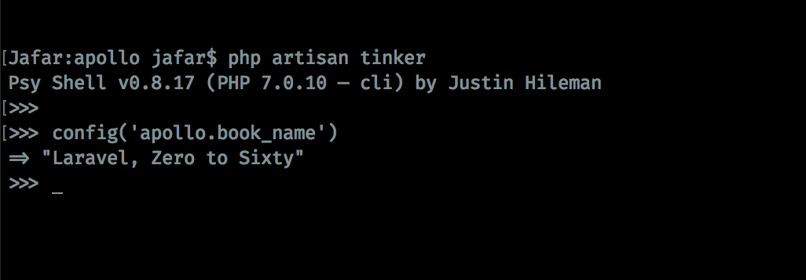
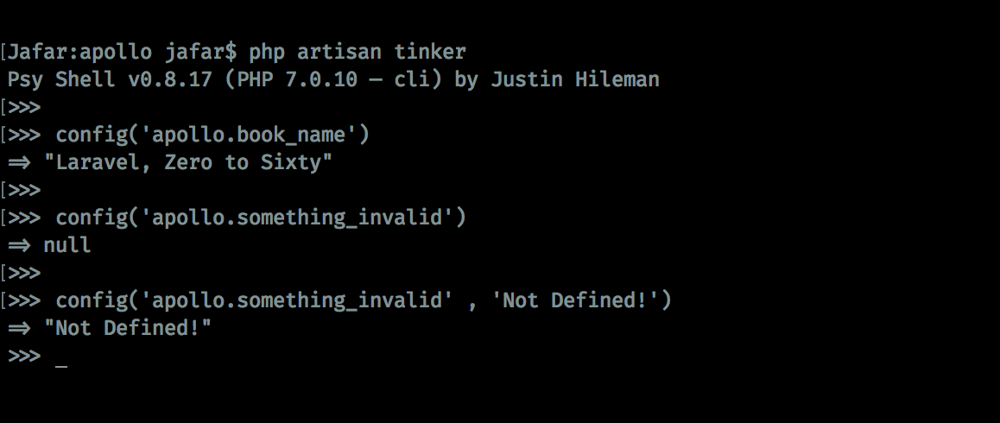

در فصل پیش، هنگامی که از نصب لاراول سخن می‌گفتیم، نگاهی به پوشه‌ی پیکربندی (config) انداختیم و تغییراتی ایجاد کردیم. حالا وقت آن رسیده که بیشتر وارد جزئیات شویم و یک پروژه‌ی واقعی را در کنار هم شروع کنیم.

شروع پروژه‌ها همیشه با تعریف و راه‌اندازی دیتابیس آغاز می‌شود و ما نیز همین راه را خواهیم رفت و برای همین هم این فصل «شروع واقعی با دیتابیس» نام دارد.
اما می‌دانید که پیش از دیتابیس چه کار دیگری هست که معمولاً انجام می‌شود؟ راه‌اندازی پیکربندی.

## یک توجیه کوچک

این که چرا درس پیکربندی را در فصل مربوط به دیتابیس این کتاب گنجانده‌ام، نیازمند کمی توضیح است. زیرا شما که این کتاب را می‌خوانید، برنامه‌نویس هستید و قاعدتاً از هوشی بالاتر از سطح متوسط برخوردار هستید و به این راحتی نمی‌توان سرتان کلاه گذاشت.
واقیت آن است که پیکربندی‌ها هم به لحاظ کاربردی، شبیه دیتابیس‌ها هستند، با این تفاوت که داده‌های آن‌ها، در زمان کدنویسی تعیین می‌شوند و در هنگام اجرای برنامه قابل تغییر نیستند. یا لااقل به این راحتی‌ها قابل تغییر نیستند. 
بنابراین ما اولین گام عملی در پروژه‌ی آپولو هوا کردن خودمان در این کتاب را با تنظیم دیتابیس شروع می‌کنیم و اولین درس تنظیم دیتابیس را به پیکربندی اختصاص می‌دهیم[^c030101].

[^c030101]: امیدوارم این توجیه شما را قانع کرده باشد، اما اگر این طور نیست، این یکی را امتحان کنید: هنگام طراحی نقشه‌ی روند آموزشی کتاب، لازم دیدم که پیکربندی را پیش از دیتابیس بشکافم و جای این موضوع در فصل قبل که به مبانی سیستمی لاراول می‌پرداخت نبود و در عین حال نمی‌توانستم یک فصل مستقل برای پیکربندی در نظر بگیرم. اگر باز هم قانع نشده‌اید، چاره‌ای نیست. همین طور که هست تحمل کنید و به خواندن ادامه دهید.

## محل پیکربندی

همه‌ی فایل‌های پیکربندی لاراول در پوشه‌ی config قرار دارند. هر کدام از این فایل‌ها، به کاری اختصاص دارند که حدس آن کار از روی نامشان زیاد سخت نیست و من بنا ندارم اسم‌هایشان را بنویسم و شرح فارسی‌شان را بازگویی کنم. هر کسی قادر است حدس بزند فایلی که session نام دارد به چه دردی می‌خورد.

شما هم می‌توانید فایل‌های خود را بسازید و داده‌هایی که نیاز دارید را در آن‌ها بریزید و خیالتان راحت باشد که این داده‌ها، همه جا در دسترس شما هستند.

## مقداردهی

فایل‌های پیکربندی لاراول، در واقع فایل‌هایی به زبان پی‌اچ‌پی هستند که یک آرایه را بازمی‌گردانند، یا به اصطلاح فنی‌تر، return می‌کنند.

برای شروع، فایلی به نام apollo.php کنار فایل‌های دیگر پوشه config ایجاد کنید و آرایه‌ای خالی را در آن return کنید.

``` php
<?php
  return [
  ];
```
حالا شما یک فایل پیکربندی برای خودتان دارید که می‌توانید هرچه خواستید در آن بریزید. 

``` php
<?php // config/apollo.php
  return [
    "book_name" => "Laravel, Zero to Sixty",
    "author_name" => "Taha Kamkar",
    "length_measuring_unit" => "m" ,
    "weight_measuring_unit" => "kg" ,
  ];
```

## بازخوانی به کمک تابع config

بازخوانی پیکربندی‌ها در لاراول، با استفاده از تابع config انجام می‌شود. به تابع config، بگویید که دنبال چه گزینه‌ای می‌گردید و آن را بگیرید.

در حال حاضر، چون هنوز مسیری برای پروژه‌ی خود تعریف نکرده‌ایم، امکان آزمایش در مرورگر را نداریم، اما مشکلات لاراولی راه‌حل‌هایی لاراولی دارند. 
چرا از کنسول آرتیزان و ابزار tinker موجود در آن کمک نگیریم؟

ابتدا تینکر را فرا بخوانید.

	php artisan tinker

و بعد در کنسول تینکر، یکی از گزینه‌هایی که ساخته‌اید را فرابخوانید.

	config("apollo.book_name")

رشته‌ای که به تابع config دادیم، ترکیبی از نام فایل پیکربندی و گزینه‌ی مورد نظر ماست که با یک نقطه از هم جدا شده‌اند.

انتظار دارید چه پاسخی بگیرید؟



اگر تابع config آنچه خواسته‌اید را نیابد، مقدار null را بازمی‌گرداند. البته این تابع، آرگومان دومی را نیز برای این جور وقت‌ها در نظر گرفته تا اگر آنچه خواسته‌اید را نیابد، همان مقدار پیش‌فرضی که تعیین کرده‌اید را به شما بازگرداند. 



در مثال بالا، سه اجرا از تابع config را می‌بینید. در اولی به دنبال چیزی بودیم که وجود داشت، و پاسخش را هم گرفتیم. در دومی به دنبال چیزی بودیم که وجود نداشت و null را دریافت کردیم، و در سومی دنبال چیزی بودیم که وجود نداشت، اما مقدار پیش‌فرضی را برای بازگشت انتخاب کرده بودیم و لاراول همان مقدار پیش‌فرض را به ما بازگرداند.

## کمی مرتب‌تر

فایل‌های پیکربندی از تودرتوییِ آرایه‌ها پشتیبانی می‌کنند. به این ترتیب، می‌توانید پیکربندی خود را کمی مرتب‌تر نمایید و نظم و ترتیبی منطقی به گزینه‌هایتان بدهید.

``` php
<?php  // config/apollo.php
  return [
    'book' => [
       'name' => "Laravel, Zero to Sixty",
       'author' => "Taha Kamkar",
    ],
    'measuring_unit' => [
     'length' => "m",
     'weight' => "kg",
    ]
  ];
```

خوشبختانه تابع config این ساختار تودرتو را تشخیص می‌دهد و با هر نقطه‌ای که می‌گذارید، یک لایه به درون می‌رود.

	config('apollo.book.name');

## تغییر در محل

اگر می‌خواهید در هنگام اجرای برنامه مقدار یک پیکربندی را تغییر دهید، آرایه‌ی تغییرات را به تابع config ارسال کنید.

	config(['apollo.measuring_unit.weight' => 'g']);

## پیکربندی‌هایی وابسته به محیط

فایل‌های پیکربندی لاراول، چنانچه مرسوم است، تحت نظارت سیستم کنترل نسخه‌ی شما قرار می‌گیرند و در میان تیم برنامه‌نویسی یکسان ظاهر می‌شوند و طبیعتاً به همان نحو که در فاز توسعه ایجاد می‌شوند، در فاز عملیاتی، روی سرور هم مورد استفاده قرار می‌گیرند.

اگر مایلید که هر کدام از اعضای تیم شما تنظیمات مخصوص به خود را در پاره‌ای از موارد داشته باشند، اگر آنچه در فاز اجرا نیاز دارید با فاز توسعه متفاوت است، و اگر به هر دلیل دیگری می‌خواهید تنظیمات خاصی را از دسترس سیستم کنترل نسخه خارج کنید، می‌توانید از قابلیت git ignore یا معادل‌های آن استفاده کنید، اما راهش این نیست!
پیش از این، هنگام نصب لاراول، از فایلی مخصوص به نام .env سخن گفتیم. لاراول این فایل ویژه را برای همین کارها در نظر گرفته تا از دسترس سیستم کنترل نسخه مصون بدارد. پیکربندی‌هایی که اینجا تعریف می‌کنید، فقط برای شماست.

اگر می‌خواهید کنترل گزینه‌ای را به فایل .env بسپارید، تعریف آن را در فایل پیکربندی این‌گونه تغییر دهید:

``` php
<?php  // config/apollo.php
  return [
    'book' => [
      'name' => "Laravel, Zero to Sixty",
      'author' => "Taha Kamkar",
    ],
    'measuring_unit' => [
      'length' => env("MEASURING_UNIT_LENGTH" , "m"),
      'weight' => env("MEASURING_UNIT_WEIGHT" , "kg"),
    ]
  ];
```

در مثال بالا، کنترل دو گزینه‌ی مربوط به واحدهای اندازه‌گیری را به فایل محیطی .env سپردیم و جهت اطمینان، برای هر کدام مقداری پیش‌فرض تعیین کردیم.

حالا تنها کاری که باقی مانده، این است که نشانی‌هایی که داده‌ایم را به فایل .env خود نیز بیافزاییم.

	MEASURING_UNIT_LENGTH=cm
	MEASURING_UNIT_WEIGHT=g

با انجام همین دو کار ساده، لاراول برای این دو گزینه، ابتدا سراغ فایل .env می‌رود و اگر آنچه را خواسته‌اید پیدا نکرد، از مقدار پیش‌فرضی که در فایل پیکربندی تعیین کرده‌اید استفاده می‌کند.

## نکته‌هایی در باب پیکربندی‌های محیطی 

#### نکته نخست

فایل .env، یک فایل پی‌اچ‌پی نیست و الگوی دستوری فایل‌های پی‌اچ‌پی در آن رعایت نمی‌شود. اگر مطمئن نیستید که چطور متغیر جدیدی تعریف کنید، از بخش‌های دیگر این فایل الگو بگیرید.

#### نکته بعدی

خالقان سیستم عامل ویندوز فکر نمی‌کردند روزی فرا برسد که کسی بخواهد فایل بدون نامی ایجاد کند و از آن استفاده نماید و برای همین هم هست که ایجاد فایل .env در ویندوز به این راحتی‌ها نیست. لاراول فایل .env.example را به همین منظور در بسته‌ی خود گذاشته تا علاوه بر آن که به عنوان الگو و مثال مورد استفاده قرار می‌گیرد، با تغییر پسوند آن بتوانید در محیط ویندوز هم یک فایل .env تر و تمیز بسازید.

#### نکته بعدی

آنچه در فایل پیکربندی محیطی .env تعریف کرده‌اید، ممکن است با سایر متغیرهای محیطی، مثل متغیرهای سطح سرور (server-level) یا سطح سیستم (system-level) بازنویسی شوند. مراقب این موضوع باشید.

#### نکته بعدی

فایل .env.example را فقط برای الگوبرداری و مثال آنجا نگذاشته‌اند. اگر بخشی از یک تیم توسعه هستید، می‌توانید نمونه‌هایی از آنچه در .env لازم دارید را در این فایل قرار دهید تا سایر اعضای تیم بدانند که چه چیزهایی را باید در فایل .env خودشان تعریف کنند. (این دقیقاً همان کاری است که لاراول کرده، وگرنه به ذکر چند مثال در آن فایل اکتفا می‌کرد.)

#### نکته بعدی

یکی از گزینه‌هایی که در فایل .env تعیین می‌شود، گزینه‌ای است با عنوان APP_ENV. این گزینه، در لاراولی که با هم نصب کرده‌ایم، قاعدتاً روی local تنظیم شده است. از روی این گزینه می‌توانید بفهمید که محیط اجرایی برنامه‌ی شما کجاست. 

#### نکته یکی مانده به آخر

در کنار فایل .env، می‌توانید فایل دیگری با عنوان .env.testing داشته باشید که مقدم بر .env قرار بگیرد و بدون دست زدن به .env اصلی، پیکربندی دیگری را برای حالت تست برنامه‌ی خود فعال کنید.

#### نکته آخر [^c030102]

[^c030102]: این آخرین نکته‌ای است که می‌نویسم، اما آخرین نکته‌ای نیست که می‌توانید بدانید. نگاه دیگری به عنوان کتاب بیاندازید و برای اطلاعات بیشتر در مورد هر موضوعی که در این کتاب مطرح شده، به مستندات دست اول لاراول مراجعه نمایید.

سعی کنید در متن برنامه‌های خود از تابع env استفاده نکنید و هر گزینه‌ای که می‌خواهید را از طریق همان تابع config بخوانید. از تابع env فقط در هنگام تعریف تنظیمات در فایل‌های پیکربندی استفاده کنید و بس.

## کش کردن پیکربندی‌ها

با هر فراخوانی تنظیمات پیکربندی، لاراول مسیر نسبتاً بلندی را برای یافتن و برگرداندن آن طی می‌کند که ممکن است نگرانی‌هایی در بازدهی برنامه ایجاد کند.
به یاد دارید که مشکلات لاراولی، راه‌حل‌هایی لاراولی نیز دارند.

لاراول می‌تواند به صورت خودکار پیکربندی‌های مورد استفاده در سیستم شما را کَش کند. طبیعتاً در فاز توسعه نیازی به این کار نیست و کافی است پس از آپلود فایل‌ها در سرور، با استفاده از کنسول آرتیزان، یک بار این کار را انجام دهید.

	php artisan config:cache

نکته‌ی آخری که در بخش پیش گفتم، را به خاطر دارید؟

سعی کنید در متن برنامه‌های خود از تابع env استفاده نکنید و هر گزینه‌ای که می‌خواهید را از طریق همان تابع config فراخوانی کنید. از تابع env فقط در هنگام تعریف تنظیمات در فایل‌های پیکربندی استفاده کنید و بس.
داستان از این قرار است که پس از کَش شدن پیکربندی‌ها، لاراول دیگر به سراغ فایل .env نمی‌رود و از آن پس، تابع env، همیشه مقدار null را بازمی‌گرداند.

